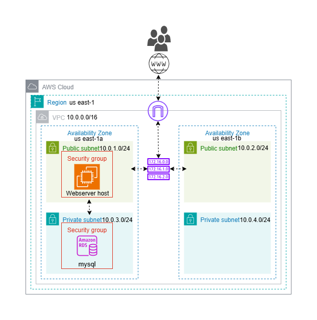
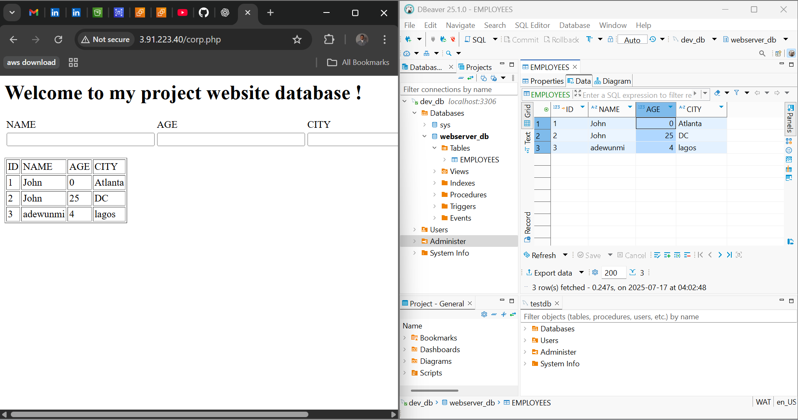

# Terraform Infrastructure Documentation

## Architecture Diagram
The following diagram illustrates the overall AWS infrastructure provisioned by this Terraform project:



This diagram shows the relationships between the VPC, subnets, route tables, security groups, EC2 webserver host, and RDS instance, providing a visual overview of the deployed resources.

This folder contains the Terraform code for provisioning a secure, highly-available AWS infrastructure, including VPC, subnets, security groups, EC2 webserver, RDS, and supporting resources. The code is modular and reusable, following best practices for infrastructure-as-code.


## Structure
### scripts/
- **bootstrap.sh**: Contains webserser instance user data to run at the launch of the instance.

### terraform/
- **main.tf**: Orchestrates the infrastructure by calling modules for VPC, subnets, route tables, security groups, EC2, and RDS.
- **provider.tf**: Configures the AWS provider and required provider versions.
- **backend_s3.tf**: Configures remote state storage in an S3 bucket for collaboration and state locking.
- **output.tf**: Exposes key outputs such as VPC ID, subnet IDs, route table IDs, EC2 instance ID, and security group IDs.
- **terraform.auto.tfvars**: Supplies actual values for input variables (e.g., environment name, DB engine, credentials).
- **variable**: Declares all input variables used across modules.
- **local.tf**: Defines local values used for cleaner expressions and consistent naming conventions.
- **source modules**: Contains reusable predefined modules for each infrastructure component from a github repo

## Module Details

### VPC Module
- Provisions a VPC with configurable CIDR, DNS support, and tags.

### Subnets Module
- Creates multiple subnets (public/private) in specified AZs, with options for public IP mapping.

### S3
- Creates a secure, versioned S3 bucket for storing VPC Flow Logs, with encryption, public access blocking, lifecycle rules for cost optimization, and an IAM role/policy to allow VPC Flow Logs to write to the bucket.

### Internet Gateway Module
- Attaches an Internet Gateway to the VPC for public subnet internet access.

### Route Tables Module
- Creates and associates route tables for public/private subnets, supporting both IGW and NAT Gateway routing.

### instance Module
- Deploys an EC2 instance in a public subnet for secure SSH access, using a specified key pair and security group. Contains a scripts folder for the setup the webserver

### RDS Module
- Provisions an RDS instance with:
  - DB subnet group
  - Configurable engine, version, storage, and instance class

### Security Group Modules
- Creates security groups for public and private resources, with dynamic ingress/egress rules.

### SSM_Parameter modules
- Generates random RDS credentials and stores them, along with DB config values, in AWS SSM Parameter Store for secure access.

### Iam_role modules
- Creates an IAM role and instance profile for EC2 to securely access SSM Parameter Store and retrieve database credentials.

## Remote State
- State is stored in an S3 bucket (`infra-terraform-backend-database-rds`) with locking enabled for safe collaboration.

## Usage
1. **Initialize Terraform**
   ```
   terraform init
   ```
2. **format the argument**
   ```
   terraform fmt
   ```
3. **validate the argument**
   ```
   terraform validate
   ```
4. **plan the deployment**
   ```
   terraform plan
   ```
5. **Apply the configuration**
   ```
   terraform apply
   ```

### Webserver view


## Notes
- All sensitive credentials (RDS username/password) are stored securely in AWS SSM Parameter Store.
- Update variable values as needed in each module for your environment.
- Ensure your AWS credentials and region are configured before running Terraform.
