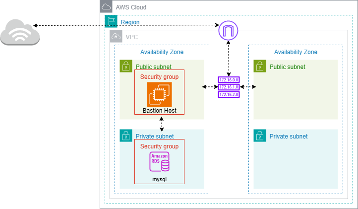

# Terraform Infrastructure Documentation

## Architecture Diagram
The following diagram illustrates the overall AWS infrastructure provisioned by this Terraform project:



This diagram shows the relationships between the VPC, subnets, route tables, security groups, EC2 bastion host, and RDS instance, providing a visual overview of the deployed resources.

This folder contains the Terraform code for provisioning a secure, highly-available AWS infrastructure, including VPC, subnets, security groups, EC2 bastion, RDS, and supporting resources. The code is modular and reusable, following best practices for infrastructure-as-code.


## Structure

### Root Folder
- **create_table.sql**: SQL script for creating the required database tables. This file is intended to be executed on the RDS instance provisioned by Terraform. It defines the schema and initial structure for your application's database, ensuring the environment is ready for use after infrastructure deployment.

### terraform/
- **main.tf**: Orchestrates the infrastructure by calling modules for VPC, subnets, route tables, security groups, EC2, and RDS.
- **provider.tf**: Configures the AWS provider and required provider versions.
- **backend_s3.tf**: Configures remote state storage in an S3 bucket for collaboration and state locking.
- **output.tf**: Exposes key outputs such as VPC ID, subnet IDs, route table IDs, EC2 instance ID, and security group IDs.
- **modules/**: Contains reusable modules for each infrastructure component:
  - **vpc/**: Provisions a VPC with configurable CIDR, DNS support, and tags.
  - **subnets/**: Creates public/private subnets in specified AZs, with options for public IP mapping.
  - **internet_gateway/**: Attaches an Internet Gateway to the VPC.
  - **routes_tables/**: Manages route tables and associations for public/private subnets.
  - **bastion/**: Deploys an EC2 instance (bastion host) in a public subnet, using the latest Ubuntu AMI and a specified key pair.
  - **rds/**: Provisions an RDS instance with secure credentials stored in AWS SSM Parameter Store, and a DB subnet group.
  - **public_security_group/** & **private_security_group/**: Creates security groups with dynamic ingress/egress rules for public/private resources.

## Module Details

### VPC Module
- Provisions a VPC with configurable CIDR, DNS support, and tags.

### Subnets Module
- Creates multiple subnets (public/private) in specified AZs, with options for public IP mapping.

### Internet Gateway Module
- Attaches an Internet Gateway to the VPC for public subnet internet access.

### Route Tables Module
- Creates and associates route tables for public/private subnets, supporting both IGW and NAT Gateway routing.

### Bastion Module
- Deploys an EC2 instance in a public subnet for secure SSH access, using a specified key pair and security group.

### RDS Module
- Provisions an RDS instance with:
  - Randomly generated username and password (stored in SSM Parameter Store)
  - DB subnet group for high availability
  - Configurable engine, version, storage, and instance class

### Security Group Modules
- Creates security groups for public and private resources, with dynamic ingress/egress rules.

## Remote State
- State is stored in an S3 bucket (`infra-terraform-backend-database-rds`) with locking enabled for safe collaboration.

## Usage
1. **Initialize Terraform**
   ```
   terraform init
   ```
2. **Plan the deployment**
   ```
   terraform plan
   ```
3. **Apply the configuration**
   ```
   terraform apply
   ```

## Outputs
- VPC ID
- Public and private subnet IDs
- Internet Gateway ID
- Route Table IDs
- EC2 instance ID
- Security Group IDs

## Notes
- All sensitive credentials (RDS username/password) are stored securely in AWS SSM Parameter Store.
- Update variable values as needed in each module for your environment.
- Ensure your AWS credentials and region are configured before running Terraform.

---
*Generated on July 11, 2025*
